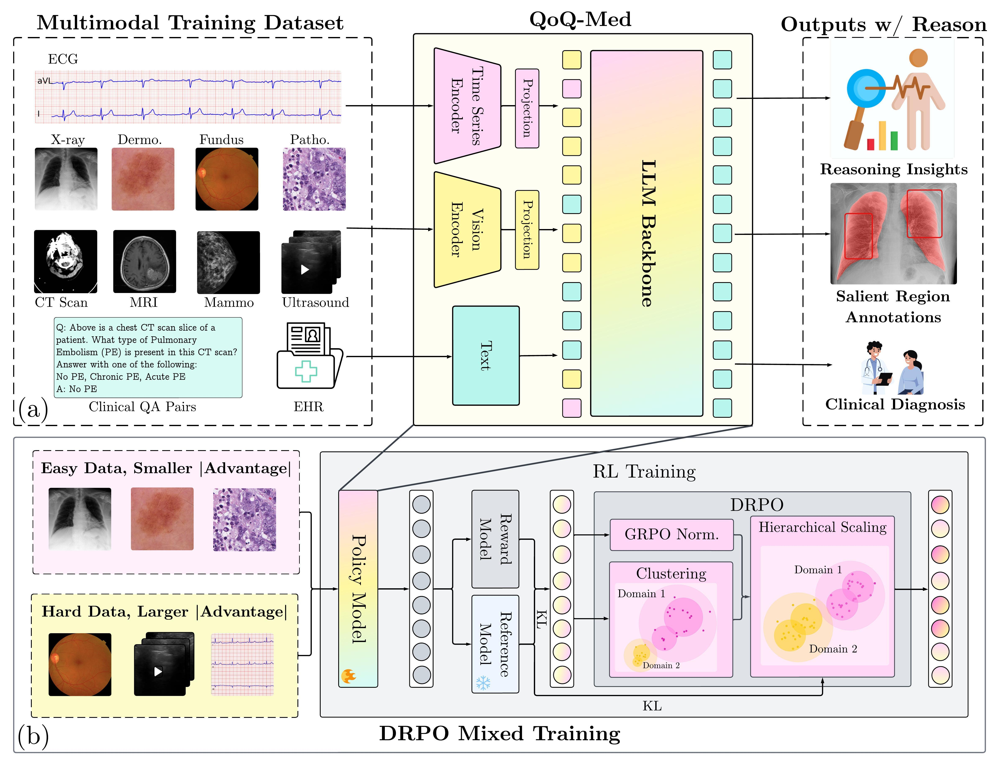

# QoQ-Med: Building Multimodal Clinical Foundation Models with Domain-Aware GRPO Training



This repository contains the code, model weights, and training pipeline for QoQ-Med (Qwen Omni-Reasoning on Medical Questions), a multimodal clinical foundation model with reasoning capabilities.

## Model Weights

| Model | Weights | Avg. Val Accuracy |
|-------|---------|---------------|
| QoQ-Med-VL-7B | [🤗 HuggingFace](https://huggingface.co/ddvd233/QoQ-Med-VL-7B) | 68.6% |
| QoQ-Med-VL-32B | [🤗 HuggingFace](https://huggingface.co/ddvd233/QoQ-Med-VL-32B) | 70.7% |

## Quick Start

### Installation

First, ensure you have the necessary dependencies:

```bash
pip install transformers qwen-vl-utils torch
```

### Loading the Model

You may load the QoQ-Med model and processors via Huggingface package:

```python
from transformers import Qwen2_5_VLForConditionalGeneration, AutoProcessor

model = Qwen2_5_VLForConditionalGeneration.from_pretrained(
    "ddvd233/QoQ-Med-VL-7B", 
    torch_dtype="auto", 
    device_map="auto"
)

processor = AutoProcessor.from_pretrained("ddvd233/QoQ-Med-VL-7B")
```

For better performance with flash attention:

```python
import torch

model = Qwen2_5_VLForConditionalGeneration.from_pretrained(
    "ddvd233/QoQ-Med-VL-7B",
    torch_dtype=torch.bfloat16,
    attn_implementation="flash_attention_2",
    device_map="auto",
)
```

### Configuring Visual Token Range

You can adjust the visual token range to balance performance and computational cost:

```python
min_pixels = 256 * 28 * 28
max_pixels = 1280 * 28 * 28

processor = AutoProcessor.from_pretrained(
    "ddvd233/QoQ-Med-VL-7B", 
    min_pixels=min_pixels, 
    max_pixels=max_pixels
)
```

### Preparing Multimodal Input

Create a message with both image and text content:

```python
messages = [
    {
        "role": "user",
        "content": [
            {
                "type": "image",
                "image": "path/to/your/medical/image.jpg",
            },
            {"type": "text", "text": "Describe this medical image."},
        ],
    }
]
```

### Processing the Input

Prepare the input for model inference:

```python
from qwen_vl_utils import process_vision_info

text = processor.apply_chat_template(
    messages, tokenize=False, add_generation_prompt=True
)

image_inputs, video_inputs = process_vision_info(messages)

inputs = processor(
    text=[text],
    images=image_inputs,
    videos=video_inputs,
    padding=True,
    return_tensors="pt",
)

inputs = inputs.to("cuda")
```

### Generating Output

Run inference and decode the output:

```python
generated_ids = model.generate(**inputs, max_new_tokens=128)

generated_ids_trimmed = [
    out_ids[len(in_ids):] 
    for in_ids, out_ids in zip(inputs.input_ids, generated_ids)
]

output_text = processor.batch_decode(
    generated_ids_trimmed, 
    skip_special_tokens=True, 
    clean_up_tokenization_spaces=False
)

print(output_text[0])
```

## Overview

QoQ-Med is the first open generalist clinical foundation model that jointly reasons across:
- Medical images (2D/3D)
- Time-series signals (ECG)
- Text reports

The model is trained with our novel Domain-aware Relative Policy Optimization (DRPO), a reinforcement learning objective that hierarchically scales normalized rewards according to domain rarity and modality difficulty, addressing performance imbalance in heterogeneous clinical data.

## Key Features

- **Multimodal Integration**: Processes and reasons across 1D, 2D, and 3D clinical data
- **Domain-Aware Training**: DRPO balances learning across 9 clinical domains
- **Enhanced Interpretability**: Generates reasoning traces and highlights salient regions
- **State-of-the-Art Performance**: Outperforms existing open-source clinical MLLMs

## Clinical Domains

QoQ-Med spans multiple clinical specialties:
- Cardiology (ECG, Chest X-ray)
- Radiology (CT, MRI, Ultrasound)
- Dermatology
- Ophthalmology (Fundus)
- Pathology
- Mammography

## Important Note

This model is intended for research purposes only. Before extensive real-world testing (like human trials), it is not suitable for clinical deployment. This is a research preview, not a product approved by federal agencies.
